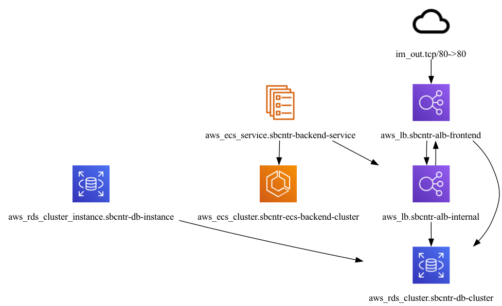
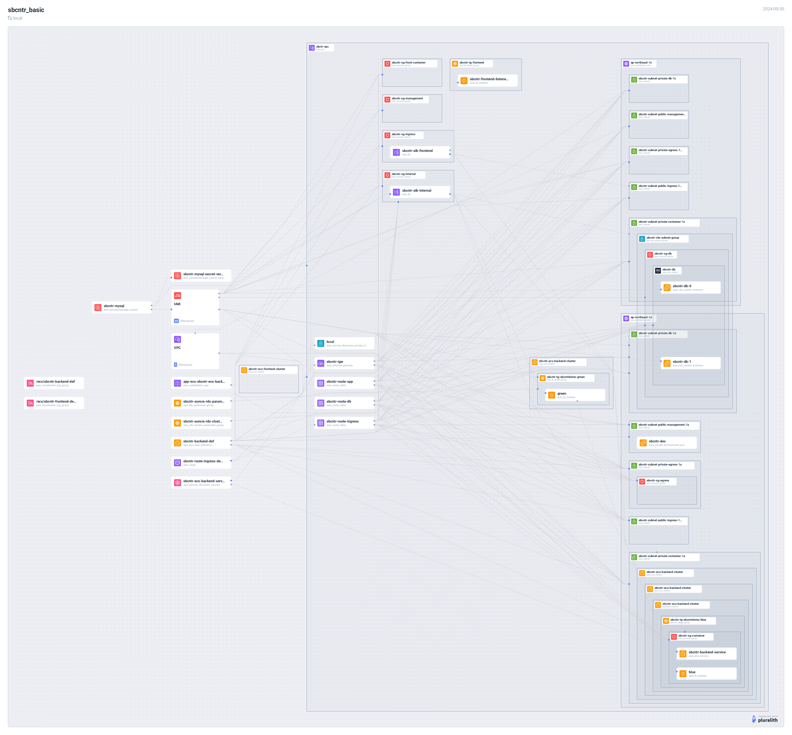

## プロジェクト名
sbcntr-basic

## プロジェクトについて
ECSで以下の技術を試したサンプルです。
- Blue/Greenデプロイ

## 構成図
- 構成図の作成には`inframap`と`pluralith`を使用している
- inframap
```bash
$ inframap generate . | dot -Tpng > inframap_generate.png
```
- pluralith
```bash
$ pluralith graph
```

### Basic
リソース概要

リソース詳細


## 開発環境構築
```bash
$ terraform apply
```
## Cloud9の環境構築
terraformで環境構築後、以下の手順を実行する
### セキュリティグループの追加
- マネジメントコンソールから、Cloud9に使用しているEC2に`sbcntr-sg-management`というセキュリティグループを追加する
### IAMロールの変更
- Cloud9に使用しているEC2のIAMロールを`sbcntr-cloud9-role`に変更して、IDE内の`[AWS Settings]``[Credentials]`からAMTCを無効化する(EC2起動時にしかプロファイルを変更できないため、要注意)
```bash
aws configure list
```
### Cloud9の空き領域の確保
- EBSボリュームを`30GiB`に変更する
- EC2インスタンスの`[インスタンスメタデータオプションの変更][インスタンスメタデータサービス]`を有効化し、`[IMDSv2]`を`Optional`に変更する
- EC2インスタンスを再起動すると、ディスクを再認識する
- Cloud9の空き容量の確保のため、次のコマンドで、シェルスクリプトを実行する
```bash
# 空き領域の確認
$ df -h
```
公式サイトにも記載あり
- https://docs.aws.amazon.com/ja_jp/cloud9/latest/user-guide/move-environment.html
- https://dev.classmethod.jp/articles/expand-the-disk-size-of-cloud9/
## アプリケーションの環境構築(イメージのビルドからイメージ登録まで)
- 1.フロントエンド
```bash
$ chmod 755 setup_frontend.sh
$ ./setup_frontend.sh
```
- 2.バックエンド
```bash
$ chmod 755 setup_backend.sh
$ ./setup_backend.sh
```
## 挙動確認
### バックエンド
```bash
# コンテナを起動
$ docker container run -d -p 8080:80 ${AWS_ACCOUNT_ID}.dkr.ecr.ap-northeast-1.amazonaws.com/sbcntr-backend:v1
# APIサーバーにリクエスト送信
$ date; curl http://localhost:8080/v1/helloworld
```
- バックエンドアプリケーションへのALB経由の疎通確認(Cloud9)
- Cloud9インスタンス->内部ALB->バックエンドアプリケーション
```bash
$ curl http://<sbcntr-alb-internalのDNS名>:80/v1/helloworld
{"data":"Hello world"}
```
### フロントエンドの挙動確認
frontend側にはECSサービスが存在せず、タスクが自動起動しないため、手動で起動させる必要がある。
- ECSから[新しいタスクの実行]を押下。
- タスク定義に`sbcntr-frontend-def`を選択
- VPCに`sbcntr-vpc`を選択
- サブネットに`container`の2つを選択
- セキュリティグループに`frontend-container`を選択
- パブリックIPの自動割り当てで、[DISABLED]を選択
- タスク起動後、プライベートIPをコピー
ターゲットグループにプライベートIPを登録する
- ターゲットグループ:`sbcntr-tg-frontend`にコンテナのプライベートIPとport:80を登録する
ブラウザで表示確認
- ALB:`sbcntr-alb-frontend`のDNS名を使ってブラウザ表示
- バックエンド側から`Hello World`が返ってきていることを確認
- インターネット向けALB->フロントエンドアプリケーション->内部ALB->バックエンドアプリケーション
## RDSの準備
- DBユーザーの作成
```bash
$ cd /home/ec2-user/environment
$ mysql -h <endpoint> -u admin -p
password: <password>
```
```sql
select host, user from mysql.user;
create user sbcntruser@'%' identified by 'sbcntrEncp';
grant all on sbcntrapp.* to sbcntruser@'%' with grant option;
create user migrate@'%' identified by 'sbcntrMigrate';
grant all on sbcntrapp.* to migrate@'%' with grant option;
grant all on `prisma_migrate_shadow_db%`.* to migrate@'%' with grant option;
select host, user from mysql.user;
exit
```
### テーブルとデータの作成
- 作成済みユーザーでのログインとテーブルが存在しないことを確認
```bash
$ cd /home/ec2-user/environment
$ mysql -h <endpoint> -u sbcntruser -p
password: sbcntrEncp
```
```bash
$ cd /home/ec2-user/environment
$ mysql -h <endpoint> -u migrate -p
password: sbcntrMigrate
```
```sql
use sbcntrapp;
show tables;
exit
```
- テーブルの作成とデータ投入(Britz.jsのmigrateコマンドを使用)
```bash
$ cd /home/ec2-user/environment/sbcntr-frontend
$ git checkout main
$ export DB_USERNAME=migrate
$ export DB_PASSWORD=sbcntrMigrate
$ export DB_HOST=<endpoint>
$ export DB_NAME=sbcntrapp
$ npm run migrate:dev
# migration名はinit
$ npm run seed
```
- テーブルとデータの確認
```bash
$ mysql -h <endpoint> -u sbcntruser -p
password: sbcntrEncp
```
```sql
use sbcntrapp;
show tables;
select * from Notification;
```
## タスク定義の更新とサービスの更新
### タスク定義の更新
- 環境変数を追加して、更新する
- 環境変数の追加
```plain text
DB_HOST valueFrom <secretmanagerのarn>:host::
DB_NAME valueFrom <secretmanagerのarn>:dbname::
DB_PASSWORD valueFrom <secretmanagerのarn>:password::
DB_USERNAME valueFrom <secretmanagerのarn>:username::
```
### サービスを更新
- 新しいリビジョンを選択し[新しいデプロイを強制]にチェック
- CodeDeployの`ECSAllAtOnce`を指定
- CodeDeployを使用して。[元のタスクを更新する]を押下
## 疎通確認
```
$ curl http://internal-sbcntr-alb-internal-2057803819.ap-northeast-1.elb.amazonaws.com:80/v1/Notifications?=id=1
```
## コンテナイメージの登録
```bash
$ cd /home/ec2-user/environment/sbcntr-frontend
$ AWS_ACCOUNT_ID=$(aws sts get-caller-identity --query 'Account' --output text)
$ git checkout main
$ docker image build -t sbcntr-frontend .
$ docker image tag sbcntr-frontend:latest ${AWS_ACCOUNT_ID}.dkr.ecr.ap-northeast-1.amazonaws.com/sbcntr-frontend:dbv1
$ aws ecr --region ap-northeast-1 get-login-password | docker login --username AWS --password-stdin https://${AWS_ACCOUNT_ID}.dkr.ecr.ap-northeast-1.amazonaws.com/sbcntr-frontend
$ docker image push ${AWS_ACCOUNT_ID}.dkr.ecr.ap-northeast-1.amazonaws.com/sbcntr-frontend:dbv1
```
## タスク定義のの更新とタスクの起動
### タスク定義の更新
- タスク定義のリビジョン変更
`dbv1`に変更
- 環境変数の追加
```plain text
DB_HOST valueFrom <secretmanagerのarn>:host::
DB_NAME valueFrom <secretmanagerのarn>:dbname::
DB_PASSWORD valueFrom <secretmanagerのarn>:password::
DB_USERNAME valueFrom <secretmanagerのarn>:username::
```
- ターゲットグループ:`sbcntr-tg-frontend`にコンテナのプライベートIPとport:80を登録する
ブラウザで表示確認
- ALB:`sbcntr-alb-frontend`のDNS名を使ってブラウザ表示

## 環境の削除
### 作業中の場合
- `sbcntr-ecs-frontend-cluster`内のタスクを手動で終了する
- 環境構築に時間がかかるので、ECRをTerraform管理下から除外
- コマンド実施後、コメントアウトする
```bash
# 一覧表示
$ terraform state list
# Terraform管理下から除外
$ terraform state rm aws_ecr_repository.sbcntr-frontend
$ terraform state rm aws_ecr_repository.sbcntr-backend
```
### 作業終了後
- (注意)ECRのイメージを事前に削除すること
```bash
$ terraform destroy 
```
## トラブルシューティング
### シークレットが作成できない場合
- デフォルトで30日間は復旧期間が設定されているため、CLIから削除する必要がある
- 削除予定のシークレットを表示させるには、[歯車マーク]を押下し、[削除予定のシークレットを表示する]にチェックする
- [Secrets Manager で [You can’t create this secret because a secret with this name is already scheduled for deletion.]が表示された時の対応](https://dev.classmethod.jp/articles/secrets-manager-error-recovery-window/)
```bash
Error: creating Secrets Manager Secret (sbcntr/mysql): operation error Secrets Manager: CreateSecret, https response error StatusCode: 400, RequestID: xxxxxxxxxx, InvalidRequestException: You can't create this secret because a secret with this name is already scheduled for deletion.
```
- 次のコマンドを実行する
```bash
$ aws secretsmanager delete-secret --secret-id sbcntr/mysql --force-delete-without-recovery
$ aws secretsmanager describe-secret --secret-id sbcntr/mysql
```

### テーブル作成時にエラーになる
- Cloud9のベースイメージを`amazonlinux-2`に変更する
- [AWSコンテナ構築・運用ハンズオン【ECS、Fargate】](https://note.shiftinc.jp/n/n16cdcc2df8bf)
```bash
$ npm run migrate:dev
Environment variables loaded from .env
Error: Unknown binaryTarget rhel-openssl-3.0.x and no custom binaries were provided
```

## 参考
https://www.sbcr.jp/support/4815609994/
